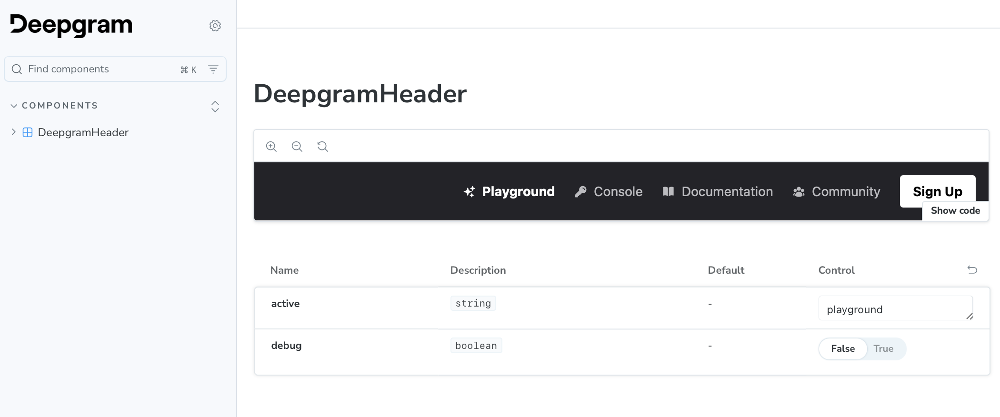

[![Built With Stencil](https://img.shields.io/badge/-Built%20With%20Stencil-16161d.svg?logo=data%3Aimage%2Fsvg%2Bxml%3Bbase64%2CPD94bWwgdmVyc2lvbj0iMS4wIiBlbmNvZGluZz0idXRmLTgiPz4KPCEtLSBHZW5lcmF0b3I6IEFkb2JlIElsbHVzdHJhdG9yIDE5LjIuMSwgU1ZHIEV4cG9ydCBQbHVnLUluIC4gU1ZHIFZlcnNpb246IDYuMDAgQnVpbGQgMCkgIC0tPgo8c3ZnIHZlcnNpb249IjEuMSIgaWQ9IkxheWVyXzEiIHhtbG5zPSJodHRwOi8vd3d3LnczLm9yZy8yMDAwL3N2ZyIgeG1sbnM6eGxpbms9Imh0dHA6Ly93d3cudzMub3JnLzE5OTkveGxpbmsiIHg9IjBweCIgeT0iMHB4IgoJIHZpZXdCb3g9IjAgMCA1MTIgNTEyIiBzdHlsZT0iZW5hYmxlLWJhY2tncm91bmQ6bmV3IDAgMCA1MTIgNTEyOyIgeG1sOnNwYWNlPSJwcmVzZXJ2ZSI%2BCjxzdHlsZSB0eXBlPSJ0ZXh0L2NzcyI%2BCgkuc3Qwe2ZpbGw6I0ZGRkZGRjt9Cjwvc3R5bGU%2BCjxwYXRoIGNsYXNzPSJzdDAiIGQ9Ik00MjQuNywzNzMuOWMwLDM3LjYtNTUuMSw2OC42LTkyLjcsNjguNkgxODAuNGMtMzcuOSwwLTkyLjctMzAuNy05Mi43LTY4LjZ2LTMuNmgzMzYuOVYzNzMuOXoiLz4KPHBhdGggY2xhc3M9InN0MCIgZD0iTTQyNC43LDI5Mi4xSDE4MC40Yy0zNy42LDAtOTIuNy0zMS05Mi43LTY4LjZ2LTMuNkgzMzJjMzcuNiwwLDkyLjcsMzEsOTIuNyw2OC42VjI5Mi4xeiIvPgo8cGF0aCBjbGFzcz0ic3QwIiBkPSJNNDI0LjcsMTQxLjdIODcuN3YtMy42YzAtMzcuNiw1NC44LTY4LjYsOTIuNy02OC42SDMzMmMzNy45LDAsOTIuNywzMC43LDkyLjcsNjguNlYxNDEuN3oiLz4KPC9zdmc%2BCg%3D%3D&colorA=16161d&style=flat-square)](https://stenciljs.com)

# Deepgram Components

Public repository with components for Deepgram demos and sites.



## What's in this repo?

This repo contains a Stencil project with a Storybook for documenting and developing UI components in isolation.

### Stencil

Stencil is a compiler for building fast web apps using Web Components.

Stencil combines the best concepts of the most popular frontend frameworks into a compile-time rather than runtime tool. Stencil takes TypeScript, JSX, a tiny virtual DOM layer, efficient one-way data binding, an asynchronous rendering pipeline (similar to React Fiber), and lazy-loading out of the box, and generates 100% standards-based Web Components that run in any browser supporting the Custom Elements v1 spec.

Stencil is also capable of generating React, Vue, and Angular versions of components.

### Storybook

Storybook is a tool for documenting and developing UI components in isolation.

## Getting Started

To start building a new component using Stencil, clone this repo to a new directory:

```bash
git clone https://github.com/deepgram/deepgram-components.git deepgram-components
cd deepgram-components
```

and run:

```bash
npm install
npm start
```

To build the component for production, run:

```bash
npm run build
```

To run the unit tests for the components, run:

```bash
npm test
```

Stencil docs are [here](https://stenciljs.com/docs/my-first-component).

## Naming Components

We recommend using `deepgram` in the component name (ex: `<deepgram-header>`).

## Using this component

You can read more about these different approaches in the [Stencil docs](https://stenciljs.com/docs/publishing).

### Lazy Loading

Our Stencil project is built with the [`dist`](https://stenciljs.com/docs/distribution) output target, so you can import a small bootstrap script that registers all components and allows you to load individual component scripts lazily.

For example, given your Stencil project namespace is called `@deepgram/web-components`, to use `deepgram-header` on any website, inject this into your HTML:

```html
<script type="module" src="https://unpkg.com/@deepgram/web-components"></script>
<!--
To avoid unpkg.com redirects to the actual file, you can also directly import:
https://unpkg.com/@deepgram/web-components@0.0.1/dist/deepgram-components/deepgram-components.esm.js
-->
<deepgram-header active="docs"></deepgram-header>
```

This will only load the necessary scripts needed to render `<deepgram-header />`. Once more components of this package are used, they will automatically be loaded lazily.

You can also import the script as part of your `node_modules` in your applications entry file:

```tsx
import '@deepgram/web-components/dist/deepgram-components/deepgram-components.esm.js';
```

### Standalone

We also use the `dist-custom-elements` output target, so we recommend importing Stencil components individually in those files where they are needed.

For example, given you'd like to use `<deepgram-header />` as part of a React component, you can import the component directly via:

```tsx
import '@deepgram/web-components/deepgram-header';

function App() {
  return (
    <>
      <div>
        <deepgram-header active="docs"></deepgram-header>
      </div>
    </>
  );
}

export default App;
```
